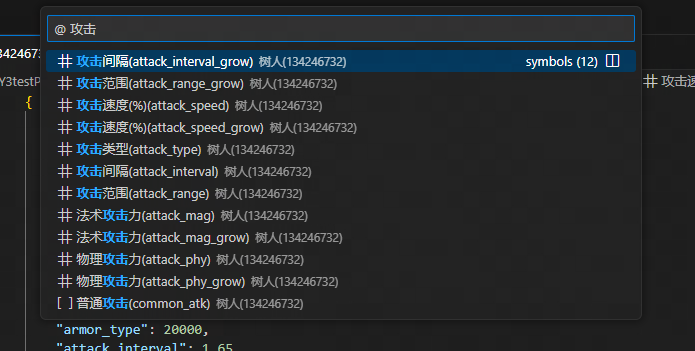

# Y3开发助手

## 初始化项目（给新建的地图使用，老地图勿用！）

1. 按 `F1` 打开命令列表，使用命令 `Y3开发助手:初始化开发环境`
2. 选择地图路径
3. 完成！

## 物编数据TreeView

在初始化项目后，你可以在explorer中的大纲(OUTLINE)和Y3开发助手:物编数据中查看Y3项目的物编数据。
你可以看到物编数据的Json和其字段名的含义，点击你想要编辑的属性，即可跳转到对应字段。
你可以在此直接编辑物编数据，因为vscode对Json文件的语法检查能力，你可以方便地对物编项目的属性直接进行编辑。

## 在vscode内查看搜索和编辑Y3项目的物编数据

在vscode中快捷键 `ctrl+T` 可以搜索对象。

你需要以名称搜索某一个物编数据可以这样：

```
# 这是一个单位
```


点击打开保存此物编数据的Json后，按下快捷键 `ctrl+shift+O`，你可以这样在此Json中搜索你要编辑的属性

```
@ 攻击
```



## 修改并导入物编(CSV)

使用命令`Y3开发助手:生成物编模板（CSV）`生成物编数据模板后，你的项目中会生成 `y3-helper/editor_table/csv` 文件夹，你可以在这些CSV表格中添加新数据以导入。

之后使用命令 `Y3开发助手:导入物编数据（CSV）` 即可将这些物编写入地图。

> 如果是老地图，请使用命令 `Y3开发助手:生成物编模板（CSV）` 来生成模板文件

> 推荐和[Edit csv](https://marketplace.visualstudio.com/items?itemName=janisdd.vscode-edit-csv)插件配合使用，以便在Visual Code内编辑CSV表格，无需打开新的窗口

> 你可以通过 `Y3-Helper.CSVPath` 设置修改这些CSV文件的路径

> CSV表格中，第一行为表头，第二行为表头的中文翻译，第三行是示例，请按照示例填写，第四行之后的才是正文，会被导入项目中。
>
## 批量添加、修改CSV表格中的物编项目UID和名称(CSV)

由于每个物编数据项目的属性种类非常多，只能放在多个CSV文件中，当你需要它们的UID或名称时，需要挨个修改每一个CSV中的此物编项目的UID和名称，所以这里有批量添加和修改的功能。


你可以选择以下命令：

```
Y3开发助手:在CSV表格中添加新物编数据
Y3开发助手:添加项目中已有的物编数据的UID和名称到CSV表格中
Y3开发助手:修改CSV表格中的物编项目的UID
Y3开发助手:修改CSV表格中的物编项目的名称
```

## 可自定义导入规则的Excel表物编数据导入

按下F1，使用命令`Y3开发助手:生成物编数据（Excel）`，会在`y3-helper/editor_table/excel` 下生成Excel物编数据模板和配套导入规则importRules.mjs,
用户可通过编写importRules.mjs实现可自定义规则的物编数据导入方式。

`importRule.mjs.ts`中定义了导入规则ImportRule的父类，请继承此父类以实现自定义的导入规则。每个ImportRule对象的属性，记录了需要被导入的Excel表的相对路径和工作表名。在调用命令`Y3开发助手:导入物编数据（Excel）`后，`importRule.mjs`会被复制到本插件的`importRules`目录下，并在运行时作为模块热载入，然后本插件会从头到尾遍历`importRules`数组的元素，从每个ImportRule对象中获取要导入的表，然后一行一行得把读到的数据给用户自定义的rowImport方法，把经过用户自定义的处理方式处理后的结果返回，并导入到Y3项目的物编数据中。

用户的自定义规则类`ImportRule`继承以下父类后，必须在子类中覆盖父类的全部方法和成员。

[importRule.mjs.ts](./template/excel/importRule.mjs.ts)

## 如何对本插件进行二次开发？

1. 安装`vscode`和`Node.js`
2. `git clone` 或其他方式下载本插件项目源码
3. 使用vscode打开项目文件夹
4. 在命令行、终端cd到项目目录下使用`npm install`命令，安装相关依赖
5. 使用`npm install -g typescript`以支持tsc
6. 使用`tsc`命令，将本项目的TS代码编译为js
7. 点击vscode的上方菜单栏`run`，在其中选择运行方式，启动本插件
